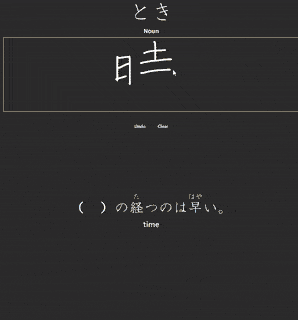

# anki-jp
Card templates for [Anki](https://apps.ankiweb.net/) kanji study based on the [Core 2k](https://ankiweb.net/shared/info/2141233552) note type

These card types are modified versions of card templates in the Core 2k deck, so it expects the same font files to be in the Anki media folder (`_stroke.ttf`, `_HGSKyokashotai.ttf`, and `_NotoSansJP-Medium.otf`).  
These are the fields used: `Vocabulary-Kanji`, `Vocabulary-Furigana`, `Vocabulary-Kana`, `Vocabulary-English`, `Vocabulary-Audio`, `Vocabulary-Pos`, `Expression`, `Reading`, `Sentence-English`, `Sentence-Clozed`, `Sentence-Audio`, `Frequency`
## Card types
1. **Reading**: See kanji & definition and recall reading
2. **Vocab**: See kanji & reading and recall definition
3. **Kanji**: See reading & definition and draw kanji on the canvas

For notes of words that are just kana, suspend the "Reading" cards

## How to add card types in Anki
Tools > Manage Note Types (Ctrl+Shift+N) > [note type name (e.g., Core 2000)] > Cards > Options (the one at the top right) > Add Card Type... (make sure to sync on all devices first)

Then paste the code into Front Template, Back Template, and Styling

## Thanks
Kana to romaji function: https://github.com/lovell/hepburn
